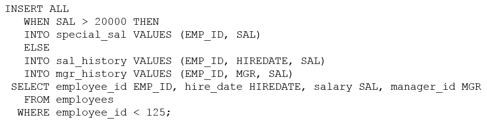

# Question 213
Examine this statement which executes successfully:

		
Which is true?

# Answers
A.Only if the salary is 20000 or less and the employee id is 125 or higher, insert EMPLOYEE_ID, MANAGER_ID, and SALARY into the MGR_HISTORY table.

B.Regardless of salary and employee id, insert EMPLOYEE_ID, MANAGER_ID, and SALARY into the MGR_HISTORY table.

C.Regardless of salary, only if the employee id is less than 125, insert EMPLOYEE_ID, MANAGER_ID, and SALARY into the MGR_HISTORY table.

D.Only if the salary is 20000 or less and the employee id is less than 125, insert EMPLOYEE_ID, MANAGER_ID, and SALARY into the MGR_HISTORY table.

# Discussions
## Discussion 1
D is correct

## Discussion 2
The condition from subquery is same for all tables i.e. data from sub query comes with employee_id > 125

if the sal > 2000 then values will insert in Special_sal
if the sal <2000 then values will insert in SAL_HISOTORY & MGR_HISTORY

CHATGPT IS WRONG 100%.

D is Correct

## Discussion 3
In INSERT ALL we can have multiple INTO clauses under conditional statements. So both INTO statement will be executed under ELSE condition.

## Discussion 4
Using chatgpt4, answer given is C. someone pls verify

Expected Outcome Based on Conditions:
For employee_id = 100 with salary = 25000:

Meets SAL > 20000, so data is inserted into special_sal.
Data is also inserted into mgr_history because the condition for the mgr_history table insertion doesn't depend on the salary.
For employee_id = 110 with salary = 18000:

Does not meet SAL > 20000, so data is inserted into sal_history.
Data is also inserted into mgr_history regardless of the salary because there's no conditional logic preventing this in the provided statement.
For employee_id = 120 with salary = 21000:

Meets SAL > 20000, so data is inserted into special_sal.
Data is also inserted into mgr_history regardless of the salary.

## Discussion 5
C is correct you can CHATGPT

