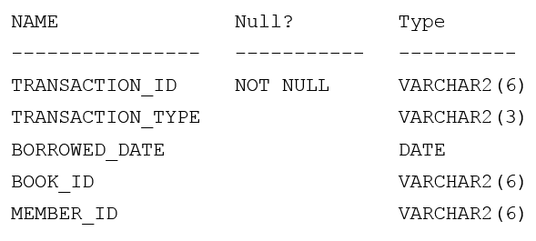

# Question 215
Examine the description of the BOOKS_TRANSACTIONS table:

		
Examine this partial SQL statement:
SELECT * FROM books_transactions
Which two WHERE conditions give the same result? (Choose two.)

# Answers
A.WHERE borrowed_date = SYSDATE AND (transaction_type = 'RM' AND member_id = 'A101' OR member_id = 'A102');

B.WHERE borrowed_date = SYSDATE AND (transaction_type = 'RM' AND (member_id = 'A101' OR member_id = 'A102'));

C.WHERE borrowed_date = SYSDATE AND transaction_type = 'RM' OR member_id IN ('A101', 'A102');

D.WHERE borrowed_date = SYSDATE AND (transaction_type = 'RM' OR member_id IN ('A101', 'A102');

E.WHERE (borrowed_date = SYSDATE AND transaction_type = 'RM') OR member_id IN ('A101', 'A102');

# Discussions
## Discussion 1
I think CE is correct

## Discussion 2
CE is correct

