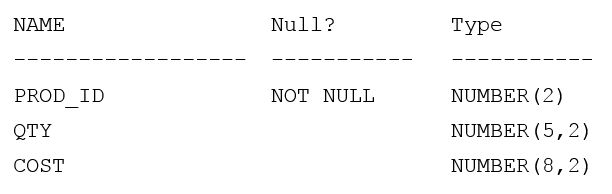

# Question 217
Examine this description of the PRODUCTS table:

		
Rows exist in this table with data in all the columns. You put the PRODUCTS table in read-only mode.
Which three commands execute successfully on PRODUCTS? (Choose three.)

# Answers
A.CREATE INDEX price_idx ON products (price);

B.ALTER TABLE products SET UNUSED (expiry_date);

C.DROP TABLE products;

D.ALTER TABLE products DROP COLUMN expiry_date;

E.TRUNCATE TABLE products;

F.ALTER TABLE products DROP UNUSED COLUMNS;

# Discussions
## Discussion 1
ACF, I have tested on Oracle DB and it works

## Discussion 2
wrong img table https://www.examtopics.com/assets/media/exam-media/02818/0024900001.png

## Discussion 3
ACE is correct

## Discussion 4
ACF is correct

## Discussion 5
The correct answer is ACE

