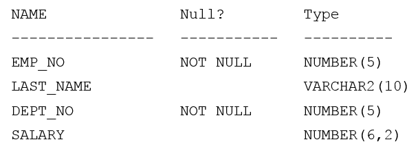

# Question 219
Examine the description of the EMPLOYEES table:

		
You write this failing statement:

		
Which clause causes the error?

# Answers
A.SELECT

B.GROUP BY

C.WHERE

D.ORDER BY

# Discussions
## Discussion 1
B GROUP BY cannot use alias

## Discussion 2
B is correct

