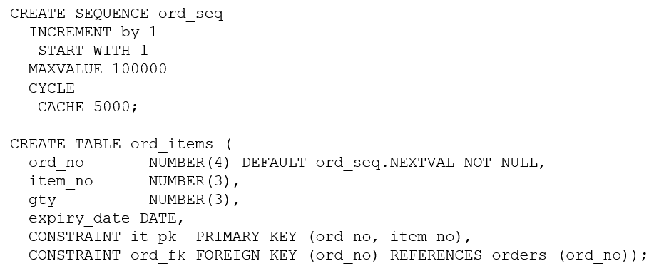

# Question 220
Evaluate these commands which execute successfully:

		
Which two statements are true about the ORD_ITEMS table and the ORD_SEQ sequence? (Choose two.)

# Answers
A.Sequence ORD_SEQ is guaranteed not to generate duplicate numbers.

B.Sequence ORD_SEQ cycles back to 1 after every 5000 numbers and can cycle 20 times.

C.Column ORD_NO gets the next number from sequence and ORD_SEQ whenever a row is inserted into ORD_ITEMS and no explicit value is given for ORD_NO.

D.If sequence ORD_SEQ is dropped then the default value for column ORD_NO will be NULL for rows inserted into ORD_ITEMS.

E.Any user inserting rows into table ORD_ITEMS must have been granted access to sequence ORD_SEQ.

# Discussions
## Discussion 1
C no doubts then its D not E
This is a common misconception. If ord_seq.NEXTVAL is used in a DEFAULT clause, users do not need direct privileges on the sequence to insert into the table.

The database evaluates the default on behalf of the user.

## Discussion 2
would be A,E. we can insert ord_no explicitly.

## Discussion 3
C for sure, then I am unsure D or E

## Discussion 4
E is correct only if we assume that user doesn't insert ord_no explicitly. If he does than he doesn't need the select privilege on the sequence.
In my oppinion only C is correct.

## Discussion 5
Cannot be A because of 'cycle' specification.

