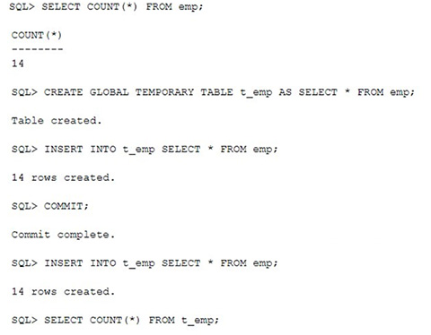

# Question 226
Examine these statements and results:

		
How many rows are retrieved by the last query?

# Answers
A.42

B.0

C.14

D.28

# Discussions
## Discussion 1
If you haven't mentioned on commit preserve / Delete, the default behavior of system is to delete all the rows of GTT. So, once commit is complete, rows are deleted. Again, Insert command will copy all the rows from EMP which is 14
C is correct. Tested as well

## Discussion 2
C is correct

## Discussion 3
Tested. 

create table PRODUCTS
(PROD_ID NUMBER,
PROD_NAME VARCHAR2(50),
PROD_CATEGORY VARCHAR2(50),
PROD_MIN_PRICE NUMBER,
PROD_UNIT_OF_MEASURE VARCHAR2(50))
    
INSERT into PRODUCTS VALUES(101,'Envoy','Hardware',6000,'Nos.') ;
INSERT into PRODUCTS VALUES(102,'Y Box','Electronics',9000,'') ;
INSERT into PRODUCTS VALUES(103,'DVD','Software/Other',2000,'Nos.') ;
INSERT into PRODUCTS VALUES(104,'Documentation','Software/Other',4000,'') ;

select * from PRODUCTS

create global temporary table t_pro as select * from PRODUCTS

insert into t_pro select * from PRODUCTS

commit

insert into t_pro select * from PRODUCTS

select count(*) from t_pro

## Discussion 4
I think the default for GTT is 'on commit delete rows'.  So after the commit there would be 0 rows but then after the next insert there would be 14.

