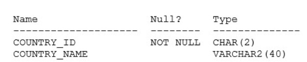
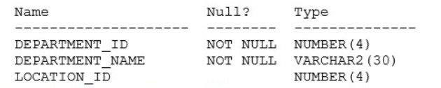
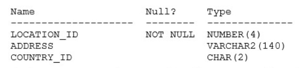

# Question 228
Examine the description of the COUNTRIES table:

		
Examine the description of the DEPARTMENTS table:

		
Examine the description of the LOCATIONS table:

		
Which two queries will return a list of countries with no departments? (Choose two.)

# Answers
A.

B.

C.

D.

# Discussions
## Discussion 1
BD correct

## Discussion 2
C. All countries - countries with departments = countries with no departments

## Discussion 3
How are BD correct? Since B, C & D are only selecting country_id and country_name they only return a list of countries with no departments. Could someone please explain this

