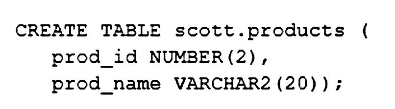

# Question 230
User HR has CREATE SESSION, CREATE ANY TABLE and UNLIMITED TABLESPACE privileges.
User SCOTT has CREATE SESSION, CREATE TABLE and UNLIMITED TABLESPACE privileges.
HR successfully executes this statement:

		
HR attempts to execute:
1. INSERT INTO scott.products VALUES (1, 'LAPTOP');
SCOTT attempts to execute:
2. SELECT * FROM products;
3. INSERT INTO scott.products VALUES (2, 'HDD');
4. CREATE SYNONYM prod FOR products;
Which will execute successfully?

# Answers
A.1, 2 and 3

B.2, 3 and 4

C.1 only

D.2 and 3 only

# Discussions
## Discussion 1
D is correct

## Discussion 2
Tested, you cannot create synonyms nor views without premission even if you are trying to do it for a object in your schema or if you want to use your schema table as a underlying table for view.

## Discussion 3
option D
Since scott has privileges create session,table and unlimited table space, the user has not rights to create synonym unless he has create synonym privilege given to scott.

## Discussion 4
User HR has the CREATE ANY TABLE privilege, which allows them to create a table in another user’s schema. In this case, HR successfully creates the products table in SCOTT’s schema.

However, HR does not have the INSERT privilege on SCOTT’s products table, so statement 1 will fail.

User SCOTT has the CREATE SESSION and CREATE TABLE privileges, which allow them to log in to the database and create tables in their own schema. Since the products table is in SCOTT’s schema, SCOTT can query and insert data into the table, so statements 2 and 3 will execute successfully.

SCOTT also has the privilege to create a synonym in their own schema, so statement 4 will execute successfully.

## Discussion 5
Why A is incorrect?

