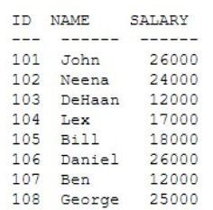

# Question 231
Examine the contents of the EMP table:

		
Examine this query that executes successfully:

		
What is the result?

# Answers
A.It will return the five employees earning the lowest salaries, in ascending order.

B.It will return the six employees earning the highest salaries, in descending order.

C.It will return the six employees earning the lowest salaries, in ascending order.

D.It will return the five employees earning the highest salaries, in descending order.

# Discussions
## Discussion 1
Option A tested in DB.
If the salary contain like the below example:
id Salary
1 12000
2 15000
3 16000
4 16000
5 17000

in this case, with ties option return extra rows

select id,salary
from emp
order by salary
fetch first 3 rows with ties;

o/p:
1 12000
2 15000
3 16000
4 16000

## Discussion 2
A tested.
However, what is the meaning of WITH TIES then. If replacing with ONLY returns the same result.

## Discussion 3
The WITH TIES returns additional rows with the same sort key as the LAST row fetched.

## Discussion 4
A is correct

## Discussion 5
A tested.
CREATE TABLE EMP
(
    ID NUMBER(10),
    NAME VARCHAR2(10),
    SALARY NUMBER(10)
)

INSERT INTO EMP VALUES (101, 'JOHN', 26000);
INSERT INTO EMP VALUES (102, 'NEENA', 24000);
INSERT INTO EMP VALUES (103, 'DEHAAN', 12000);
INSERT INTO EMP VALUES (104, 'LEX', 17000);
INSERT INTO EMP VALUES (105, 'BILL', 18000);
INSERT INTO EMP VALUES (106, 'DANIEL', 26000);
INSERT INTO EMP VALUES (107, 'BEN', 12000);
INSERT INTO EMP VALUES (108, 'GEORGE', 25000);

SELECT * FROM EMP
ORDER BY SALARY
FETCH FIRST 5 ROWS WITH TIES;

