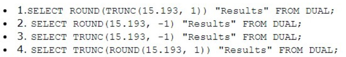

# Question 233
Examine this list of queries:

		
Which two statements are true? (Choose two.)

# Answers
A.1 and 4 give different results.

B.2 returns the value 20.

C.3 returns an error.

D.1 and 4 give the same result.

E.2 and 3 give the same result.

# Discussions
## Discussion 1
BD is correct

## Discussion 2
BD tested 
SELECT ROUND (TRUNC (15.193, 1)) "Results" FROM DUAL; 
SELECT ROUND (15.193, -1) "Results" FROM DUAL; 
SELECT TRUNC (15.193, -1) "Results" FROM DUAL;  
SELECT TRUNC (ROUND (15.193, 1)) "Results" FROM DUAL;

## Discussion 3
BD , 15,20,10,15 result

## Discussion 4
B, D Correct tested in Oracle

## Discussion 5
Checked, B, D is correct

