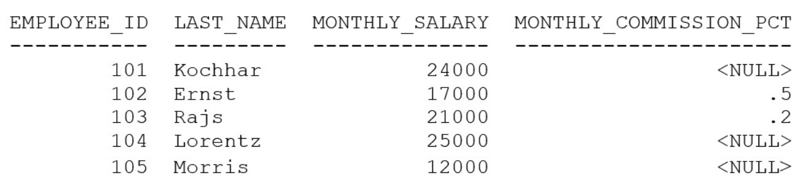

# Question 234
Examine the data in the EMPLOYEES table:

		
Which statement will compute the total annual compensation for each employee?

# Answers
A.SELECT last_name, (monthly_salary * 12) + (monthly_salary * 12 * NVL(monthly_commission_pct, 0)) AS annual_comp FROM employees;

B.SELECT last_name, (monthly_salary * 12) + (monthly_salary * 12 * monthly_commission_pct) AS annual_comp FROM employees;

C.SELECT last_name, (monthly_salary + monthly_commission_pct) * 12 AS annual_comp FROM employees;

D.SELECT last_name, (monthly_salary * 12) + (monthly_commission_pct * 12) AS annual_comp FROM employees;

# Discussions
## Discussion 1
A tested

## Discussion 2
A is correct

