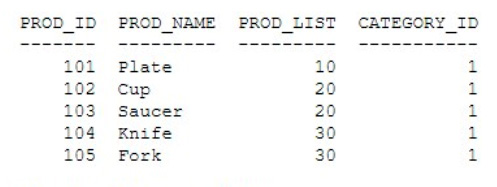
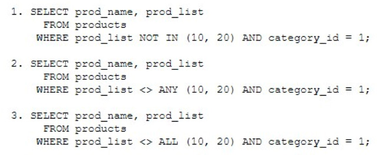

# Question 235
Examine the data in the PRODUCTS table:

		
Examine these queries:

		
Which queries generate the same output?

# Answers
A.1 and 3

B.2 and 3

C.1, 2, and 3

D.1 and 2

# Discussions
## Discussion 1
A is correct

## Discussion 2
A tested

