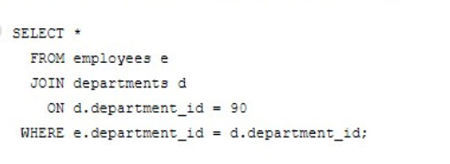
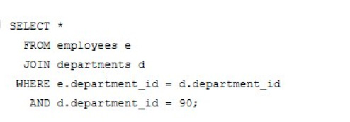
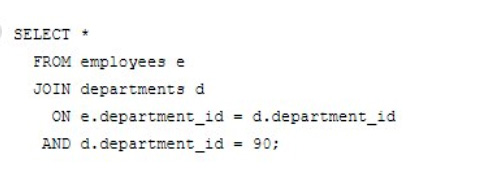
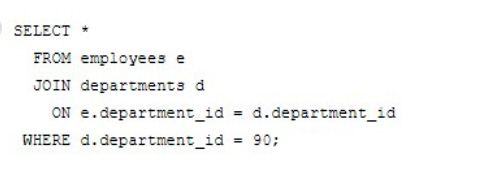

# Question 236
Which statement fails to execute successfully?

# Answers
A.

		

B.

		 

C.

		

D.

		

# Discussions
## Discussion 1
B is correct not A

## Discussion 2
B is correct

## Discussion 3
Tested, B is correct answer

## Discussion 4
ORA-00905: missing keyword

## Discussion 5
B is correct, I get error: “missing keyword”  (no ON condition). All others execute sucessfully.

