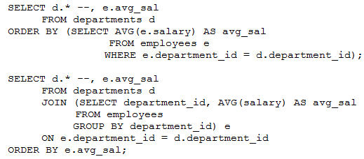

# Question 237
Examine these statements which execute successfully:

		
Both statements display departments ordered by their average salaries.
Which two are true? (Choose two.)

# Answers
A.Both statements will execute successfully if you add E.AVG_SAL to the select list.

B.Both statements will display departments with no employees.

C.Only the second statement will execute successfully if you add E.AVG_SAL to the select list.

D.Only the first statement will display departments with no employees.

E.Only the second statement will display departments with no employees.

F.Only the first statement will execute successfully if you add E.AVG_SAL to the select list.

# Discussions
## Discussion 1
Actually, I think C & D are the correct answers

## Discussion 2
B & C are the correct answers

## Discussion 3
Correct Answer: BC Tested
A->The first select returns ORA-00904 
D ->Wrong because both statement have d.* in the select list, so both will display departments with no employees
E-> Wrong like D
F -> Wrong like A

## Discussion 4
D E tested

