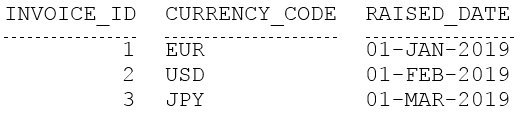
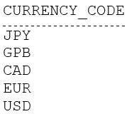
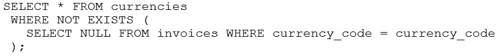
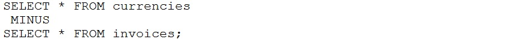
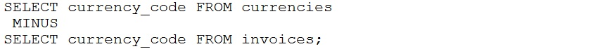
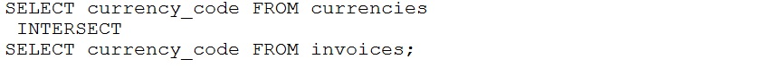

# Question 24
Examine the data in the INVOICES table:

		
Examine the data in the CURRENCIES table:

		
Which query returns the currencies in CURRENCIES that are not present in INVOICES?
A.

		
B.

		
C.

		
D.

		

# Answers
A. 

		

B. 

		

C. 

		

D. 

		

# Discussions
## Discussion 1
For anyone confused A isn't gonna work because you didn't use aliases so its not comparing the right things.
Here is the correct query

create table invoices(
    invoice_id number,
    currency_code varchar2(10),
    raised_date date
);
insert into invoices values(1, 'EUR', to_date('01-jan-2019'));
insert into invoices values(2, 'USD', to_date('01-feb-2019'));
insert into invoices values(3, 'JPY', to_date('01-mar-2019'));

create table currencies(
    currency_code varchar2(10)
);

insert into currencies values('JPY');
insert into currencies values('GPD');
insert into currencies values('CAD');
insert into currencies values('EUR');
insert into currencies values('USD');

select *
from invoices;

select *
from currencies;

select *
from currencies c
where not exists (
    select null from invoices i where i.currency_code = c.currency_code
);

## Discussion 2
for minus operator one needs to specify the colums. 
Intersect gives you the matching data. 
So C

## Discussion 3
C is correct.

## Discussion 4
D IS CORRECT OPTION...AS THE NUMBER OF COLUMN ARE NOT SAME IN BOTH TABLES..PRACTICALLY IMPLEMENTED..CORRECT OPTION D

