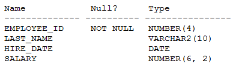

# Question 245
Examine the description of the EMPLOYEES table:

		
Examine these requirements:
1.	Display the last name, date of hire and the number of years of service for each employee.
2.	If the employee has been employed 5 or more years but less than 10, display “5+ years of service”.
3.	If the employee has been employed 10 or more years but less than 15, display “10+ years of service”.
4.	If the employee has been employed 15 or more years, display “15+ years of service”.
5.	If none of these conditions matches, display “<5 years of service”.
6.	Sort the results by the HIRE_DATE column.
Which statement satisfies all the requirements?

# Answers
A.

B.

C.

D.

# Discussions
## Discussion 1
Correct answer is D
SELECT e.last_name, hire_date, sysdate,        
(CASE WHEN  (sysdate -TO_YMINTERVAL('15-0')) >= hire_date THEN '15 years of service'
WHEN (sysdate -TO_YMINTERVAL('10-0'))                  >= hire_date THEN '10 years of service'
WHEN (sysdate - TO_YMINTERVAL('5-0'))                   >= hire_date  THEN '5 years of service'
ELSE '<5 years of service' END) AS years      
FROM   employees 
ORDER BY hire_date

## Discussion 2
Logic has to be higher to lower otherwise condition will not address 2nd row D is correct 

select last_name, hire_date,

Case
    When sysdate - to_yminterval ('20-0') >= hire_date then 'Older than 20 years Employees'
    When sysdate - to_yminterval ('10-0') >= hire_date then 'Older than 10 years Employees'
    When sysdate - to_yminterval ('5-0') >= hire_date then 'Older than 5 years Employees'
    Else 'New Employees'
END as "Employees Duration"
from emp
order by "Employees Duration" desc
;

## Discussion 3
I think answer is B.

