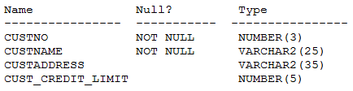

# Question 249
Examine the description of the CUSTOMERS table:

		
CUSTNO is the PRIMARY KEY.
You must determine if any customers’ details have been entered more than once using a different CUSTNO, by listing all duplicate names.
Which two methods can you use to get the required result? (Choose two.)

# Answers
A.self join

B.RIGHT OUTER JOIN with self join

C.LEFT OUTER JOIN with self join

D.FULL OUTER JOIN with self join

E.subquery

# Discussions
## Discussion 1
Answer A,E

