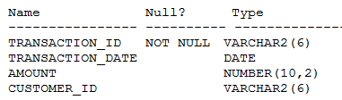

# Question 251
Examine the description of the TRANSACTIONS table:

		
Which two SQL statements execute successfully? (Choose two.)

# Answers
A.SELECT customer_id AS “CUSTOMER_ID”, transaction_date AS “DATE”, amount + 100 DUES FROM transactions;

B.SELECT customer_id AS ‘CUSTOMER_ID’, transaction_date AS DATE, amount + 100 ‘DUES’ FROM transactions;

C.SELECT customer_id AS “CUSTOMER_ID”, transaction_date AS DATE, amount + 100 “DUES” FROM transactions;

D.SELECT customer_id AS CUSTOMER_ID, transaction_date AS TRANS_DATE, amount + 100 “DUES AMOUNT” FROM transactions;

E.SELECT customer_id CUSTID, transaction_date TRANS_DATE, amount + 100 DUES FROM transactions;

# Discussions
## Discussion 1
A,D,E is correct. Tested. Feel free to try

SELECT 'abc' AS "customer_id", Sysdate as "date", 10+100 Dues FROM DUAL; {ASS

SELECT 'abc' AS 'customer_id', Sysdate as date, 10+100 'Dues' FROM DUAL; Fail because single quote for alias and not double quote on date. Alias cannot be in a single quote and date must be in a double quote as date is saved as a datatype

SELECT 'abc' AS "customer_id", Sysdate as DATE, 10+100 "Dues" FROM DUAL; FAIL. No double quote for date

SELECT 'abc' AS "customer_id", Sysdate as TRANS_DATE, 10+100 "Dues AMOUNT" FROM DUAL; PASS

SELECT 'abc' CUSTID, Sysdate TRANS_DATE, 10+100 Dues FROM DUAL; PASS

## Discussion 2
A, D, E are correct

## Discussion 3
ADE correct.

## Discussion 4
IT works 1) with as keyword , 2) with double quote 3) with out ANY quote but NOT WITH SINGLE QUOTE. Tested.

## Discussion 5
Based on the question, A, E and E are correct.

Single quotes aren't allowed for column names, and DATE requires double quotes since DATE is a key word.

