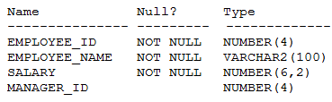
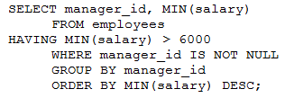
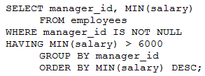
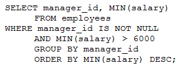
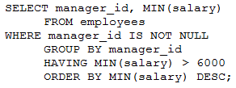

# Question 256
Examine the description of the EMPLOYEES table:

		
Examine these requirements:
1. Display the manager id and salary of the lowest paid employee for that manager.
2. Exclude anyone whose manager is not known.
3. Exclude any managers where the minimum salary is 6000 or less.
4. Sort the output by minimum salary with the highest salary shown first.
Which statement will do this?

# Answers
A.

		

B.

		

C.

		

D.

		

# Discussions
## Discussion 1
Sorry, my correct: 

A. is incorrect - the WHERE clause does not come after HAVING clause

B. is technically incorrect, as the HAVING clause comes after the GROUP BY, however, in Oracle SQL, this can work and will produce the correct answer.

C: is incorrect - cannot use an aggregated function straight in the WHERE clause

D. Correct.

## Discussion 2
A. is incorrect - the WHERE clause does not come after HAVING clause

B. is technically incorrect, as the HAVING clause comes after the GROUP BY, however, in Oracle SQL, this cannot work and will produce the correct answer.

C: is incorrect - cannot use an aggregated function straight in the WHERE clause

D. Correct.

