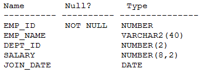

# Question 258
Examine the description of the EMPLOYEES table:

		
Which query is valid?

# Answers
A.SELECT dept_id, join_date, SUM(salary) FROM employees GROUP BY dept_id;

B.SELECT dept_id, join_date, SUM(salary) FROM employees GROUP BY dept_id, join_date;

C.SELECT dept_id, MAX(AVG(salary)) FROM employees GROUP BY dept_id;

D.SELECT dept_id, AVG(MAX(salary)) FROM employees GROUP BY dept_id;

# Discussions
## Discussion 1
Aggregate Functions Rule: You cannot nest aggregate functions like MAX(AVG()) or AVG(MAX()).

