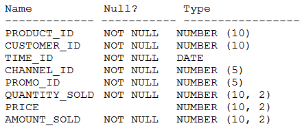
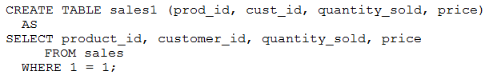

# Question 260
Examine the description of the SALES table:

		
The SALES table has 55,000 rows.
Examine this statement:

		
Which two statements are true? (Choose two.)

# Answers
A.SALES1 is created with 55,000 rows.

B.SALES1 has NOT NULL constraints on any selected columns which had those constraints in the SALES table.

C.SALES1 is created with no rows.

D.SALES1 is created with 1 row

E.SALES1 has PRIMARY KEY and UNIQUE constraints on any selected columns which had those constraints in the SALES table.

# Discussions
## Discussion 1
A. SALES1 is created with 55,000 rows.
  The `WHERE 1=1` condition is always true, so it selects **all rows** from `sales`.  
  Since `sales` has **55,000 rows**, `sales1` will also have **55,000 rows**.

B. SALES1 has NOT NULL constraints on any selected columns which had those constraints in the SALES table.
  Oracle preserves `NOT NULL` constraints** during CTAS. These are the **only constraints** that are automatically copied over.  
  Other constraints like `PRIMARY KEY`, `UNIQUE`, `CHECK`, and `FOREIGN KEY` are **not** retained.

## Discussion 2
Just a shot in the dark, but maybe D?

