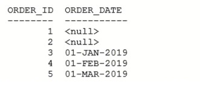
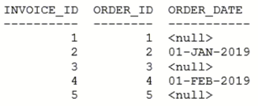
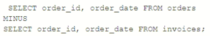

# Question 262
Examine the data in the ORDERS table:

		
Examine the data in the INVOICES table:

		
Examine this query:

		
Which three rows will it return? (Choose three.)

# Answers
A.2

B.1

C.3

D.5D. 5 01-MAR-2019

E.3 01-JAN-2019

F.4 01-FEB-2019

# Discussions
## Discussion 1
I’m leaning heavily toward D on this one.

