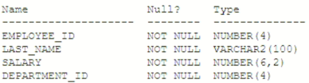
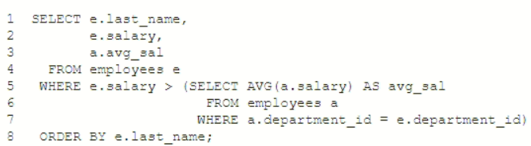

# Question 264
Examine the description of the EMPLOYEES table:

		
Examine this query:

		
Which line produces an error?

# Answers
A.Line 3

B.Line 5

C.Line 7

D.Line 8

# Discussions
## Discussion 1
Leaning toward D, but I'd be interested to hear arguments for the others.

