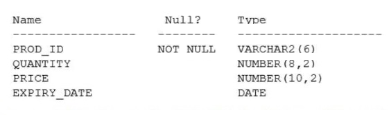

# Question 269
Examine this description of the PRODUCTS table:

		
Rows exist in this table with data in all the columns. You put the PRODUCTS table in read-only mode.
Which three commands execute successfully on PRODUCTS? (Choose three.)

# Answers
A.ALTER TABLE products DROP COLUMN expiry_date;

B.TRUNCATE TABLE products;

C.DROP TABLE products;

D.CREATE INDEX price_idx ON products (price);

E.ALTER TABLE products DROP UNUSED COLUMNS;

F.ALTER TABLE products SET UNUSED (expiry_date);

# Discussions
## Discussion 1
WE CAN DROP THE UNUSED COLUMNS SINCE IT DOESNOT CHANGE THE STRUCTURE THE DATA STRUCTURE

## Discussion 2
Since the columns are already set as unused u can drop them. 
U cant set the columns to unused for a read only table

## Discussion 3
D. CREATE INDEX price_idx ON products (price);
E. ALTER TABLE products DROP UNUSED COLUMNS;
F. ALTER TABLE products SET UNUSED (expiry_date);

