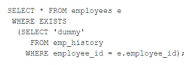

# Question 271
Examine this statement:

		
Which two are true? (Choose two.)

# Answers
A.The statement executes successfully only if the subquery does not return multiple rows.

B.The subquery is not a correlated subquery.

C.The subquery is evaluated once for each row selected by the outer query.

D.The subquery is executed for every row in the EMP_HISTORY table.

E.The subquery is a correlated subquery.

# Discussions
## Discussion 1
D is the only option that isn't immediately wrong.

