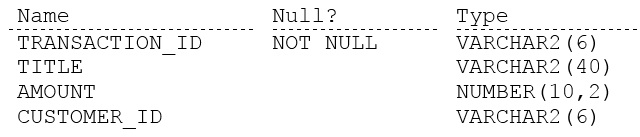

# Question 36
Examine the description of the BOOKS table:

		
The table has 100 rows.
Examine this sequence of statements issued in a new session:
INSERT INTO books VALUES ('ADV112', 'Adventures of Tom Sawyer', NULL, NULL);
SAVEPOINT a;
DELETE FROM books;
ROLLBACK TO SAVEPOINT a;
ROLLBACK;
Which two statements are true? (Choose two.)

# Answers
A.The second ROLLBACK command replays the delete.

B.The first ROLLBACK command restores the 101 rows that were deleted and commits the inserted row.

C.The first ROLLBACK command restores the 101 rows that were deleted, leaving the inserted row still to be committed.

D.The second ROLLBACK command undoes the insert.

E.The second ROLLBACK command does nothing.

# Discussions
## Discussion 1
Rollback without savepoint:
- end of the transaction
- delete savepoints
- undoes all changes in the transactions

## Discussion 2
A. The second ROLLBACK command replays the delete.
This is false. The second rollback undoes the INSERT operation but does not affect the DELETE. The first rollback already restored the rows deleted before the savepoint.

B. The first ROLLBACK command restores the 101 rows that were deleted and commits the inserted row.
This is false. The first rollback restores the deleted rows but does not commit the inserted row. The insert is still in an uncommitted state until the second rollback is issued.

C. The first ROLLBACK command restores the 101 rows that were deleted, leaving the inserted row still to be committed.
This is true. The first rollback restores the deleted rows (100 rows), and the inserted row is still uncommitted, meaning it will be undone by the second rollback.

D. The second ROLLBACK command undoes the insert.
This is true. The second rollback undoes the insert, as it was the most recent uncommitted operation at the time.

E. The second ROLLBACK command does nothing.
This is false. The second rollback does undo the inserted row ('ADV112', 'Adventures of Tom Sawyer'), so it does something.

## Discussion 3
CD are correct

## Discussion 4
For me DE

## Discussion 5
Seems right!

