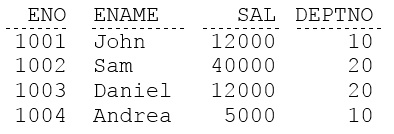
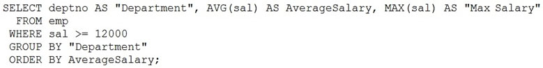

# Question 38
Examine the data in the EMP table:

		
You execute this query:

		
Why does an error occur?

# Answers
A.An alias name must not contain space characters.

B.An alias name must always be specified in quotes.

C.An alias name must not be used in an ORDER BY clause.

D.An alias name must not be used in a GROUP BY clause.

# Discussions
## Discussion 1
alias does not work with Group by and Having

