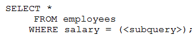

# Question 4
Examine this partial statement:

		
Which is true?

# Answers
A.Both the query and the subquery can select only zero rows or one row.

B.Both the query and the subquery can select any number of rows.

C.The query can select only zero rows or one row, but the subquery can select any number of rows.

D.The query can select any number of rows, but the subquery can select only zero rows or one row.

# Discussions
## Discussion 1
The answer is D.
'Salary = ' can only equate to 1 or 0 lines.

## Discussion 2
D is correct

