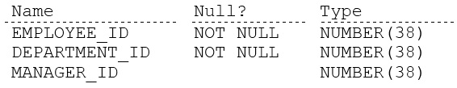
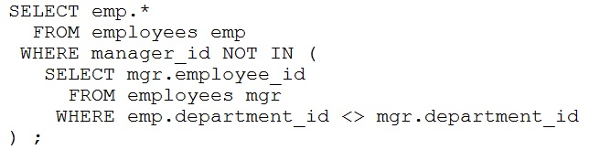
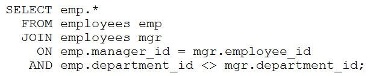
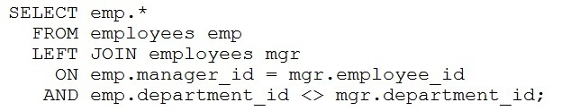
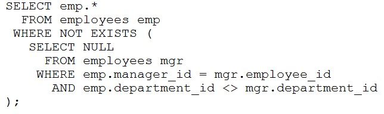
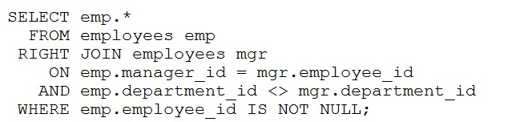

# Question 41
Examine the description of the EMPLOYEES table:

		
Which two queries return rows for employees whose manager works in a different department? (Choose two.)
A.

		
B.

		
C.

		
D.

		
E.

		

# Answers
A. 

		

B. 

		

C. 

		

D. 

		

# Discussions
## Discussion 1
Can anyone please explain why option E is the right answer here? why not C?

