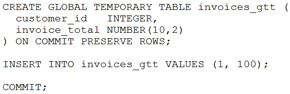

# Question 44
You start a session and execute these commands successfully:

		
Which two are true? (Choose two.)

# Answers
A.To drop the table in this session, you must first truncate it.

B.Other sessions can view the committed row.

C.You can add a column to the table in this session.

D.You can add a foreign key to the table.

E.When you terminate your session, the row will be deleted.

# Discussions
## Discussion 1
1. CREATE GLOBAL TEMPORARY TABLE my_temp_table (
  id           NUMBER,
  description  VARCHAR2(20)
)
ON COMMIT PRESERVE ROWS
2. INSERT INTO my_temp_table VALUES (1, 'ONE');
3. Commit;
4. ALTER TABLE my_temp_table
ADD ID_1 VARCHAR(20); --> ORA-14450: attempt to access a transactional temp table already in use
5. drop table my_temp_table; --> ORA-14452: attempt to create, alter or drop an index on temporary table already in use
6. truncate table my_temp_table;
7. drop table my_temp_table;

## Discussion 2
Here is an example of the differences between session-specific and transaction-specific GTT with comments:
 
drop table temp1 purge;
CREATE GLOBAL TEMPORARY TABLE temp1(
    id INT,
    description VARCHAR2(100)
) ON COMMIT DELETE ROWS;
INSERT INTO temp1(id,description) 
    VALUES(1,'Transaction specific global temp table');
SELECT id, description FROM temp1; -- 1 row is there
commit;
SELECT id, description FROM temp1; -- row is gone after the transaction 
ALTER TABLE temp1 Add ID_1 char(20);  -- will add column after commit because it is transaction specific
drop table temp1;

CREATE GLOBAL TEMPORARY TABLE temp2(
    id INT,
    description VARCHAR2(100)
) ON COMMIT PRESERVE ROWS;
INSERT INTO temp2(id,description)
VALUES(1,'Session specific global temp table');
SELECT id, description FROM temp2; --1 row is there
commit;
SELECT id, description FROM temp2; -- 1 row is still there
ALTER TABLE temp2 Add ID_1 char(20);  --will not work with or without commit after INSERT. It's in session
drop table temp2;  -- won't work. session specific
truncate table temp2;
drop table temp2; -- now it works

## Discussion 3
for me , correct  are
A. To drop the table in this session, you must first truncate it.
E. When you terminate your session, the row will be deleted.

## Discussion 4
You cant add an fk to a temporary table. Can't refer to it and cannot refer to another table from the temporary table. Tried it out!

## Discussion 5
DDL operation on global temporary tables
It is not possible to perform a DDL operation (except TRUNCATE) on an existing global temporary table if one or more sessions are currently bound to that table.

