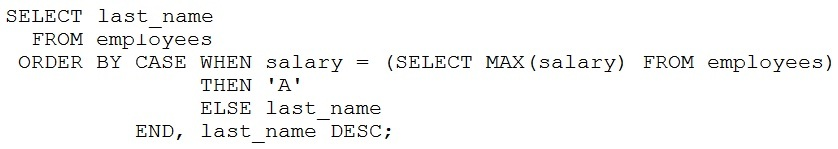

# Question 45
Examine this statement:

		
Which two statements are true? (Choose two.)

# Answers
A.The names of employees earning the maximum salary will appear first in an unspecified order.

B.All remaining employee names will appear in descending order.

C.All remaining employee names will appear in an unspecified order.

D.All remaining employee names will appear in ascending order.

E.The names of employees earning the maximum salary will appear first in ascending order.

F.The names of employees earning the maximum salary will appear first in descending order.

# Discussions
## Discussion 1
A. The names of employees earning the maximum salary will appear first in an unspecified order: Because if there more than one employ with the same salary the order is unspecified cuz both will use 'A' letter.
B. All remaining employee names will appear in descending order. Because there is last_name DESC

I should just google the answers instead of depending on the ones here...

## Discussion 2
DF is the correct
create table emp(last_name varchar2(100), salary number);

insert all 
into emp values('Shri',5000)
into emp values('van',5000)
into emp values('ben',15000)
into emp values('zoo',15000)
into emp values('cat',4000)
select * from dual;

output:
zoo
ben
Shri
cat
van

## Discussion 3
A. The names of employees earning the maximum salary will appear first in an unspecified order: Because if there more than one employ whit the same salary the order is unspecified.
B. All remaining employee names will appear in descending order. Because there is last_name DESC

## Discussion 4
DF is correct

## Discussion 5
DF is correct

