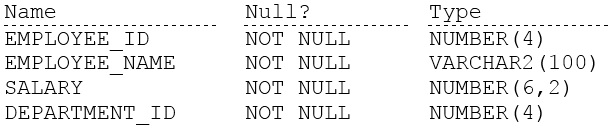
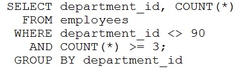
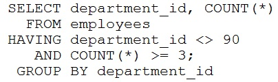
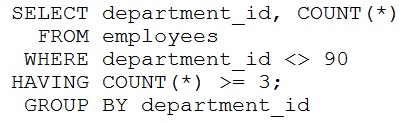
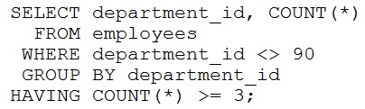

# Question 47
Examine the description of the EMPLOYEES table:

		
Which statement will fail?
A.

		
B.

		
C.

		
D.

		

# Answers
A. 

		

B. 

		

C. 

		

D. 

		

# Discussions
## Discussion 1
The first query is syntactically incorrect. You cannot use the COUNT function in the WHERE clause.

The second query is also incorrect. The HAVING clause is used to filter the results of an aggregation, and it should be used after the GROUP BY clause, not after the WHERE clause.

The third query is also incorrect for the same reason as the second one. The HAVING clause should come after the GROUP BY clause.

The fourth query is correct and will work as expected. It filters rows where the department_id is not equal to 90 using the WHERE clause, groups the remaining rows by department_id, and then applies the HAVING clause to count the rows within each group and filter out groups where the count is greater than or equal to 3.

## Discussion 2
It's a mess! the first three are incorrect for the semicolon

## Discussion 3
Don't pay attention about semicolon and the answer is A.
Order of HAVING and GROUP BY doesn't matter. 
WHERE is not required in statement.

## Discussion 4
A
if you correct the semicolon to each and every query A the one that is failing with ORA-00934: group function is not allowed here

## Discussion 5
D is the right answer. Works fine and AB and C are incorrect by semicolon

