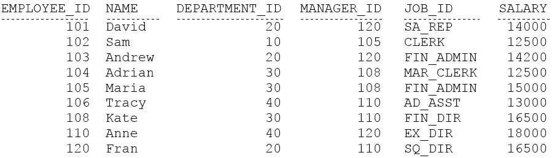
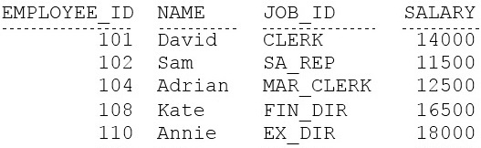
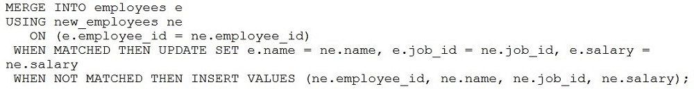
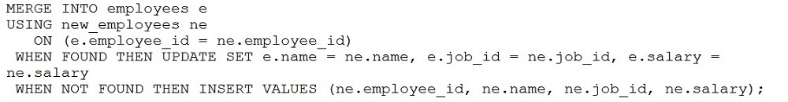
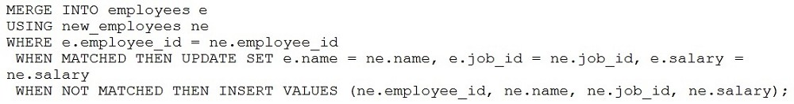
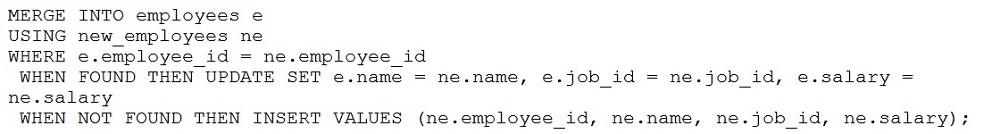

# Question 48
Examine the data in the NEW_EMPLOYEES table:

		
Examine the data in the EMPLOYEES table:

		
You want to:
1. Update existing employee details in the EMPLOYEES table with data from the NEW_EMPLOYEES table.
2. Add new employee details from the NEW_EMPLOYEES table to the EMPLOYEES table.
Which statement will do this?
A.

		
B.

		
C.

		
D.

		

# Answers
A. 

		

B. 

		

C. 

		

D. 

		

# Discussions
## Discussion 1
B is not correct because "when found then" isnt valid syntax
C doesnt have an on clause
D also has a "when found then" which isnt valid

