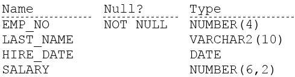
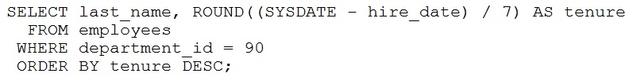
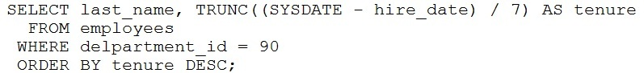
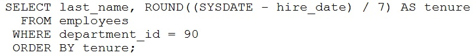
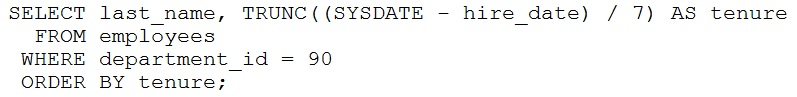

# Question 49
Examine the description of the EMPLOYEES table:

		
For each employee in department 90 you want to display:
1. their last name
2. the number of complete weeks they have been employed
The output must be sorted by the number of weeks, starting with the longest serving employee first.
Which statement will accomplish this?
A.

		
B.

		
C.

		
D.

		

# Answers
A. 

		

B. 

		

C. 

		

D. 

		

# Discussions
## Discussion 1
its asking for complete weeks so its B

## Discussion 2
B. 
Rounding up gives then employees extra days for their "complete" weeks. B would make more sense.

## Discussion 3
Are you kidding me? 
Why paying for incorrect answers?
Obviously the answer is B!

## Discussion 4
how to filter department = 90 when theres no Department or Dept_ID in the table...
All options must be wrong.

## Discussion 5
Task ask for number of COMPLETE weeks - so TRUNC , not ROUND function should be used

Answer is B

