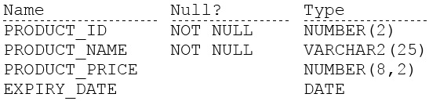

# Question 50
Examine the description of the PRODUCT_DETAILS table:

		
Which two statements are true? (Choose two.)

# Answers
A.EXPIRY_DATE contains the SYSDATE by default if no date is assigned to it.

B.PRODUCT_PRICE can be used in an arithmetic expression even if it has no value stored in it.

C.PRODUCT_NAME cannot contain duplicate values.

D.EXPIRY_DATE cannot be used in arithmetic expressions.

E.PRODUCT_PRICE contains the value zero by default if no value is assigned to it.

F.PRODUCT_ID can be assigned the PRIMARY KEY constraint.

# Discussions
## Discussion 1
BF are correct

## Discussion 2
You can add NULL to a number it will result in NULL

## Discussion 3
B is wrong, absence of data means null. An arithmetic operation with a null value always yields null

## Discussion 4
We dont know if there's any duplicate values for the id column so how do we know if it can be a PK

## Discussion 5
BF correct

