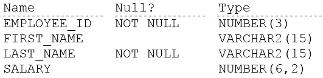
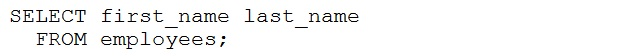
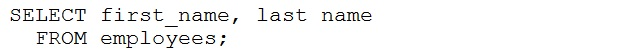
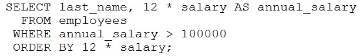
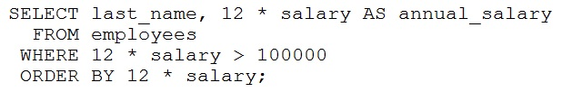
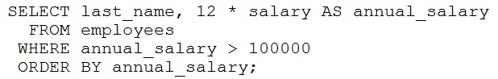
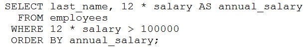

# Question 51
Examine the description of the EMPLOYEES table:

		
Which two queries will result in an error? (Choose two.)
A.

		
B.

		
C.

		
D.

		
E.

		
F.

		

# Answers
A. 

		

B. 

		

C. 

		

D. 

		

# Discussions
## Discussion 1
Correct answer: C and E

## Discussion 2
Cannot use aliases in WHERE clause:

ORA-00904: "ANNUAL_SALARY": invalid identifier

## Discussion 3
AB -> typos
CE -> fails

## Discussion 4
C and E because of the alias used in the where clause

## Discussion 5
BCE fail. Tested all.

