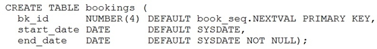
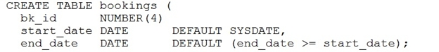
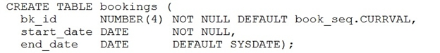
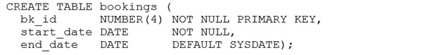
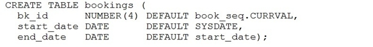

# Question 55
BOOK_SEQ is an existing sequence in your schema.
Which two CREATE TABLE commands are valid? (Choose two.)
A.

		
B.

		
C. C.

		
D.

		
E.

		

# Answers
A. 

		

B. 

		

D. 

		

# Discussions
## Discussion 1
for Book.seq currval-  is there a logical error despite the statement does execute?

## Discussion 2
How not null and primary key can be set on the same column as primary key = not null + unique key ? I checked it is possible but technically it should not work in that way

## Discussion 3
Can any one explain A,D are the correct answers

## Discussion 4
CURRVAL might have a null value so option C may not work.

