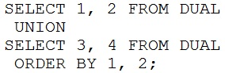
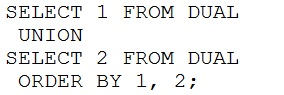
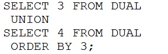
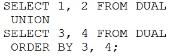

# Question 62
Which statement will execute successfully?
A.

		
B.

		
C.

		
D.

		

# Answers
A. 

		

B. 

		

C. 

		

D. 

		

# Discussions
## Discussion 1
@cspro2410

A)If your running both select without order by means it will union and return only 2 columns and after giving order by 1,2 it will run successfully. This is because 1,2 represents two columns.
B)In here it will union and it return one column only but in order by its given 1,2 so will fail
C)Here it will union and it return one column but order by is happening on 3rd column
D)Here union and it return two columns but order by happening on 3rd,4th column 

so a is correct

## Discussion 2
1. The ORDER BY clause uses the column of the first SELECT query.
2. By default, the first column of the first SELECT query is used to sort the ouput in ascending order.
3. The ORDER BY clause accepts the column name or an alias.
4. You can use ORDER BY clause only once in a compound query.
5. The ORDER BY clause does not recognize the column names of the second SELECT query. To avoid confusion over column names, it is common practice to ORDER BY column positions.

## Discussion 3
A for sure

## Discussion 4
why C is incorrect ?

