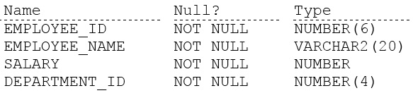
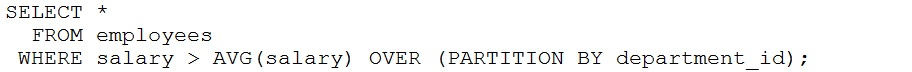
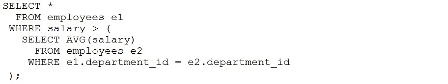
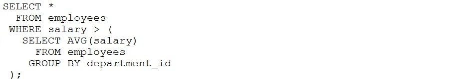
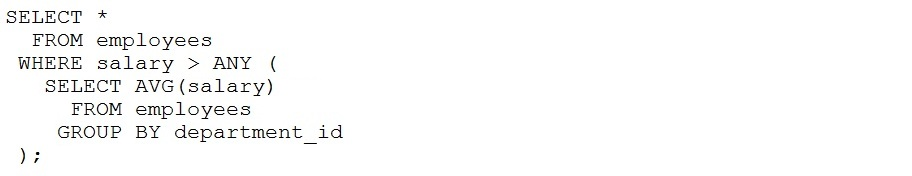
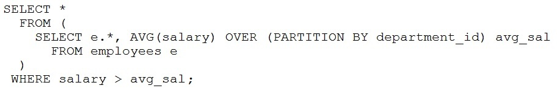

# Question 63
Examine the description of the EMPLOYEES table:

		
Which two queries return all rows for employees whose salary is greater than the average salary in their department? (Choose two.)
A.

		
B.

		
C.

		
D.

		
E.

		

# Answers
A. 

		

B. 

		

C. 

		

D. 

		

# Discussions
## Discussion 1
IN E, the column alias avg_salary from the sub query is used in the WHERE clause of the main query. Is that allowed?

## Discussion 2
A,B and E by chatGpt

## Discussion 3
B & D is correct only. 
E is not

