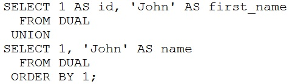

# Question 66
Examine this statement:

		
What is returned upon execution?

# Answers
A.an error

B.2 rows

C.0 rows

D.1 row

# Discussions
## Discussion 1
Because both rows are the same, the UNION result gives distinct answers

## Discussion 2
Option-B is the correct choose

## Discussion 3
D because it is union

## Discussion 4
Union will get rid of duplicate so only 1 row remaining

## Discussion 5
It is not union all to return duplicated rows

