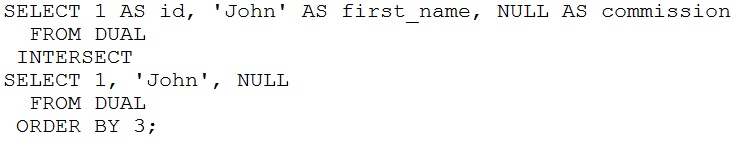

# Question 67
Examine this statement:

		
What is returned upon execution?

# Answers
C.0 rows

A.an error

B.2 rows

D.1 row

# Discussions
## Discussion 1
It returns 1 row, because the values are the same. I do tested as well

## Discussion 2
D tested 
select 1 as id, 'john' as first_name, NULL as commission from dual
intersect
select 1, 'john' as name, null from dual order by 3;

## Discussion 3
INTERSECT will only keep rows that exists for both tables so only 1 row remaining

## Discussion 4
Oracle documentation says:
“In set operations, two NULLs are considered equal when determining duplicates.”

## Discussion 5
tested on 19c, returns 0 rows.

