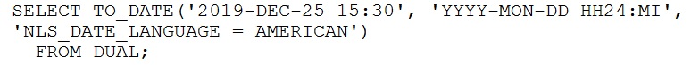
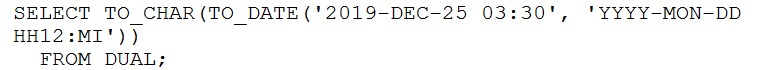
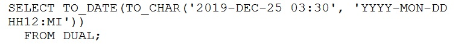
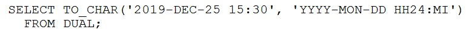
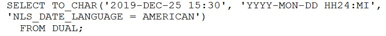

# Question 68
Which two statements execute successfully? (Choose two.)
A.

		
B.

		
C.

		
D.

		
E.

		

# Answers
A. 

		

B. 

		

C. 

		

D. 

		

# Discussions
## Discussion 1
AB tested

## Discussion 2
the answer is A and B tested

## Discussion 3
how did u extract only text from this text image

## Discussion 4
why is D wrong?

