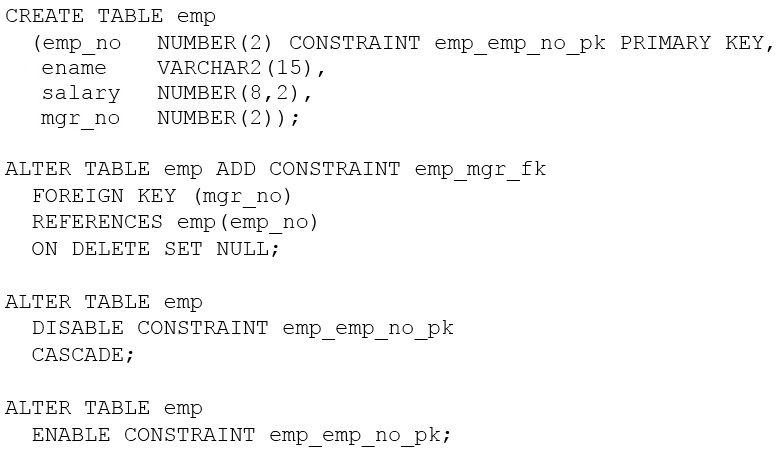

# Question 7
Examine these SQL statements which execute successfully:

		
Which two statements are true after execution? (Choose two.)

# Answers
A.The primary key constraint will be enabled and IMMEDIATE.

B.The foreign key constraint will be enabled and DEFERRED.

C.The primary key constraint will be enabled and DEFERRED.

D.The foreign key constraint will be disabled.

E.The foreign key constraint will be enabled and IMMEDIATE.

# Discussions
## Discussion 1
AD. Due to the PK being disabled, the FK is disabled. PK afterwards is enabled again

## Discussion 2
Never knew what DEFERRED was. One keeps, learning every day.

## Discussion 3
AD is the correct answer

## Discussion 4
AD
Cascade constraint will disable to primay key as well as foreign key.

## Discussion 5
What does it mean by IMMEDIATE tho?

