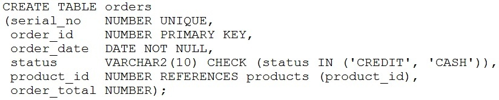

# Question 71
Examine this statement:

		
On which two columns of the table will an index be created automatically? (Choose two.)

# Answers
A.ORDER_ID

B.ORDER_TOTAL

C.ORDER_DATE

D.PRODUCT_ID

E.STATUS

F.SERIAL_NO

# Discussions
## Discussion 1
UNIQUE and PRIMARY key constraints will have unique index created automatically

## Discussion 2
Selected Answer: AF

