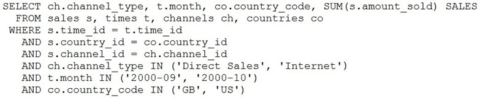
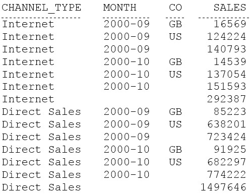

# Question 72
Examine this partial query:

		
Examine this output:

		
Which GROUP BY clause must be added so the query returns the results shown?

# Answers
A.GROUP BY ch.channel_type, ROLLUP(t.month, co.country_code);

B.GROUP BY ch.channel_type, t.month, ROLLUP(co.country_code);

C.GROUP BY CUBE(ch.channel_type, t.month, co.country_code);

D.GROUP BY ch.channel_type, t.month, co.country_code;

# Discussions
## Discussion 1
D is the correct answer

## Discussion 2
D is correct, can't say about rollup

## Discussion 3
A for me

## Discussion 4
create table channels_order (
channel_type varchar2(50),
month date,
code varchar2(5),
sales number);

insert into channels_order values('internet','2009-09','GB',16569);
insert into channels_order values('internet','2009-09','US',124224);
insert into channels_order values('internet','2009-10','GB',14539);
insert into channels_order values('internet','2009-10','US',137054);

insert into channels_order values('direct sales','2009-09','GB',85223);
insert into channels_order values('direct sales','2009-09','US',638201);
insert into channels_order values('direct sales','2009-10','GB',91925);
insert into channels_order values('direct sales','2009-10','US',682297);

select channel_type,month,code,sum(sales) sums from channels_order ch
group by channel_type,rollup(month,code);

## Discussion 5
Ok, out of curiosity I added the first group to see the result... 16569+124224+14539+137054 = 292386. A difference of 1?? Why? Could it have been a sum of undisplayed decimal values?

