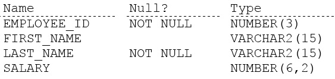

# Question 73
Examine the description of the EMPLOYEES table:

		
Which statement will execute successfully, returning distinct employees with non-null first names?

# Answers
A.SELECT first_name, DISTINCT last_name FROM employees WHERE first_name <> NULL;

B.SELECT first_name, DISTINCT last_name FROM employees WHERE first_name IS NOT NULL;

C.SELECT DISTINCT * FROM employees WHERE first_name IS NOT NULL;

D.SELECT DISTINCT * FROM employees WHERE first_name <> NULL;

# Discussions
## Discussion 1
Not valid to compare NULL to any value must use IS NOT NULL or IS NULL

## Discussion 2
C is OK, last comment was a mistake.

## Discussion 3
Distinct should come first after select, also we use is not null 
so it is C.

## Discussion 4
AD are the correct answers

