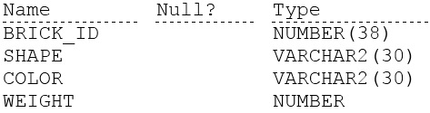
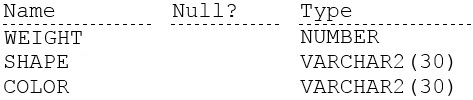
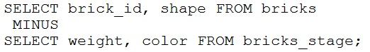
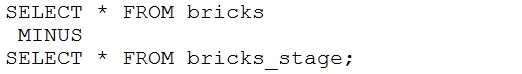
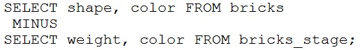
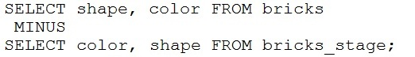
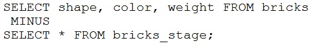

# Question 74
Examine the description of the BRICKS table:

		
Examine the description of the BRICKS_STAGE table:

		
Which two queries execute successfully? (Choose two.)
A.

		
B.

		
C.

		
D.

		
E.

		

# Answers
A. 

		

B. 

		

C. 

		

D. 

		

# Discussions
## Discussion 1
AD are the correct answers

## Discussion 2
A D
create table briks ( brick_id number(38)
                         , shape varchar2(30)
                         , color varchar2(30)
                         , weight number );

create table bricks_stage( weight number
                         , shape varchar2(30)
                         , color varchar2(30));
                         
   --A +                      
  select brick_id , shape from briks
  minus
  select weight, color from bricks_stage;
  
 --B -
select * from briks
  minus
select * from bricks_stage;

-- C -
  select shape, color from briks
  minus
  select weight, color from bricks_stage;
  
-- D +
  select shape, color from briks
  minus
  select color, shape from bricks_stage;
  
--E   
  select shape, color, weight from briks
  minus
  select * from bricks_stage;

## Discussion 3
B is wrong
ORA-01789: query block has incorrect number of result columns
E is wrong
ORA-01790: expression must have same datatype as corresponding expression

AD is the correct answer.

## Discussion 4
A,D are correct

## Discussion 5
AD IS RIGHT

