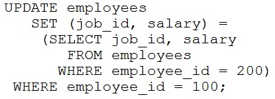

# Question 75
Table EMPLOYEES contains columns including EMPLOYEE_ID, JOB_ID and SALARY.
Only the EMPLOYEE_ID column is indexed.
Rows exist for employees 100 and 200.
Examine this statement:

		
Which two statements are true? (Choose two.)

# Answers
A.Employees 100 and 200 will have the same SALARY as before the update command.

B.Employee 100 will have JOB_ID set to the same value as the JOB_ID of employee 200.

C.Employee 200 will have JOB_ID set to the same value as the JOB_ID of employee 100.

D.Employees 100 and 200 will have the same JOB_ID as before the update command.

E.Employee 100 will have SALARY set to the same value as the SALARY of employee 200.

F.Employee 200 will have SALARY set to the same value as the SALARY of employee 100.

# Discussions
## Discussion 1
Inner query is run first then update query is ran

## Discussion 2
BE Correct

## Discussion 3
BE ARE CORRECT.

