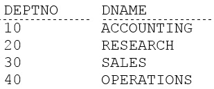
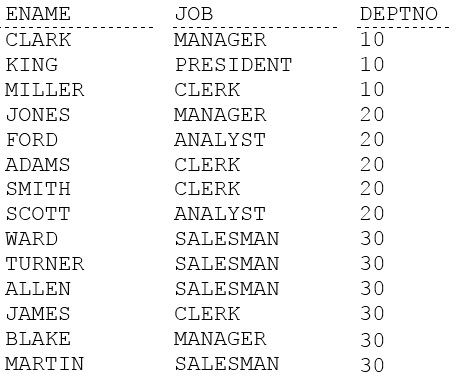
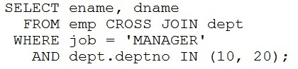

# Question 76
Examine these two queries and their output:
SELECT deptno, dname FROM dept;

		
SELECT emame, job, deptno FROM emp ORDER BY deptno;

		
Now examine this query:

		
How many rows will be displayed?

# Answers
A.64

B.6

C.3

D.12

# Discussions
## Discussion 1
B is correct answer
From first table it will take 2 records, from second table it will take 3 records. After cross join we will have 6 records (2x3).

## Discussion 2
B IS CORRECT.

## Discussion 3
B is correct because in emp table he take all manager rows then in dept he take 10 and 20
will be 3*2=6

## Discussion 4
3 x 2 = 6 so B

## Discussion 5
Ans is 4 cause each manager from  from emp table  (clark and jones) is matched with both dept table (10,20)---2*2=4

