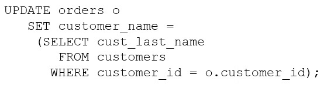

# Question 8
Examine this SQL statement:

		
Which two are true? (Choose two.)

# Answers
A.All existing rows in the ORDERS table are updated.

B.The subquery is executed before the UPDATE statement is executed.

C.The subquery is not a correlated subquery.

D.The subquery is executed for every updated row in the ORDERS table.

E.The UPDATE statement executes successfully even if the subquery selects multiple rows.

# Discussions
## Discussion 1
A and D tested on Oracle 12c1

## Discussion 2
BD,
A is incorrect only matching rows are updated, not all
C is invalid, statement correct structure
E is incorrect, in case multiple rows, error multiple rows in subquery

## Discussion 3
Answer: A and D are correct.

B is not correct because the subquery is executed for each row in the ORDERS table, not before the update statement is executed.
C is not correct because the subquery is a correlated subquery, not a non-correlated subquery.
E is not correct because if the subquery selects multiple rows, the update statement will fail with a "subquery returns more than one row" error.

## Discussion 4
E - wrong because will cause an error "ORA-01427: Subquery returns more than one row"

## Discussion 5
Correct Answers:
A. All existing rows in the ORDERS table are updated.
D. The subquery is executed for every updated row in the ORDERS table.

